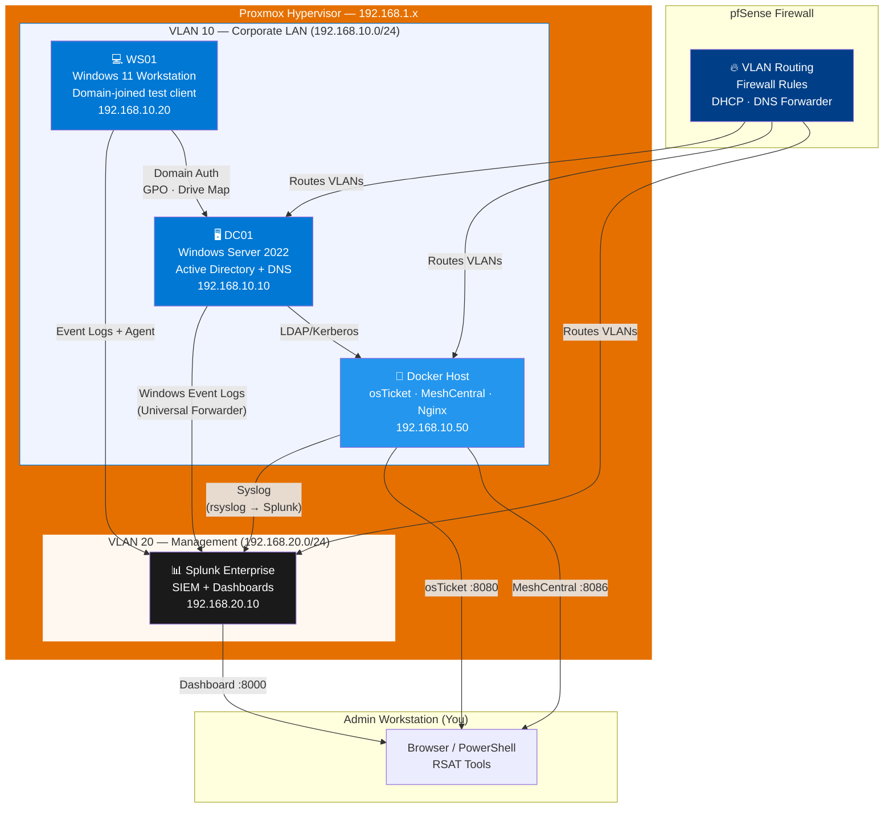

# CorpTech Enterprise IT Simulation Lab

> A fully self-hosted homelab simulating a small corporate IT environment — Active Directory, helpdesk ticketing, remote support, and SIEM monitoring — built to demonstrate real-world IT operations skills.


---

## Table of Contents

- [Overview](#overview)
- [Architecture](#architecture)
- [Components](#components)
- [Lab Network](#lab-network)
- [Prerequisites](#prerequisites)
- [Setup Guide](#setup-guide)
- [Screenshots](#screenshots)
- [Resume Bullets](#resume-bullets)
- [Skills Demonstrated](#skills-demonstrated)
- [Project Structure](#project-structure)

---

## Overview

This lab simulates the IT infrastructure of a 50-person company ("CorpTech"). It covers the full helpdesk lifecycle: a user submits a ticket in osTicket, a technician remotes into their machine via MeshCentral, resolves the issue using PowerShell automation, and the activity is detected and dashboarded in Splunk — all running on self-hosted infrastructure with no cloud dependencies.

**What makes this different from a simple lab:**
- Every component reflects a real enterprise design decision (VLAN segmentation, access-based enumeration on shares, GPO-enforced security baseline, SLA-tiered ticketing)
- 15 pre-populated tickets with realistic user personas, full conversation threads, and documented resolutions
- Splunk alerts fire on actual AD security events — account lockouts, brute force, GPO changes — not simulated data
- PowerShell scripts are production-grade: idempotent, fully logged, with confirmation prompts and `-WhatIf` support

---

## Architecture



### Data Flow Summary

```
User Submits Ticket          Agent Receives Alert         Agent Resolves
─────────────────            ────────────────────         ──────────────
User hits lockout       →    Splunk fires alert      →    Run PS script:
osTicket ticket created →    Email → helpdesk@corp   →    02-unlock-account.ps1
                        →    Agent opens MeshCentral  →    Root cause identified
                        →    Remote desktop to WS01   →    Ticket closed in osTicket
                        →    Check Event Log 4740     →    Action logged to Splunk
```

---

## Components

| Component | Technology | Purpose | Port(s) |
|-----------|-----------|---------|---------|
| **Hypervisor** | Proxmox VE 8 | Host all VMs | — |
| **Firewall** | pfSense | VLAN routing, DHCP, firewall rules | — |
| **Domain Controller** | Windows Server 2022 + AD DS | Authentication, DNS, GPO, SYSVOL | 389, 636, 88 |
| **Ticketing** | osTicket (Docker) | Helpdesk ticket management | 8080 |
| **Remote Support** | MeshCentral (Docker) | Self-hosted RMM / remote desktop | 8086, 4433 |
| **Reverse Proxy** | Nginx (Docker) | Route to osTicket | 80 |
| **SIEM** | Splunk Enterprise | Log aggregation, alerts, dashboard | 8000 |
| **Workstation** | Windows 11 | Domain-joined test client with MeshCentral agent | — |

### Active Directory Configuration

- **Domain:** `corp.local` | **Forest/Domain Level:** Windows Server 2016+
- **3 OUs:** IT · HR · Finance (under `OU=CorpUsers`)
- **7 Security Groups:** GRP-IT-Admins, GRP-IT-HelpDesk, GRP-HR-Staff, GRP-Finance-Staff, GRP-VPN-Users, GRP-SharedDrive-RW, GRP-SharedDrive-RO
- **10 Users:** Realistic names with manager relationships, department attributes, and role-appropriate group memberships

**4 Group Policy Objects:**

| GPO | Linked To | What It Does |
|-----|-----------|-------------|
| CORP-Password-Policy | Domain root | 14-char min, complexity, 90d expiry, lockout after 5 attempts |
| CORP-Login-Banner | Domain root | Legal notice / AUP displayed at logon |
| CORP-USB-Restriction | OU=Computers | Blocks read/write on all removable storage |
| CORP-Drive-Map | OU=CorpUsers | Maps `\\DC01\CompanyShare` as Z: via GPP |

### osTicket Configuration

- **Departments:** IT Helpdesk · Network Operations
- **SLA Plans:** Critical (1h) · High (4h) · Normal (8h) · Low (24h)
- **Help Topics:** Account Issues, Hardware, Software, Network + 4 sub-topics
- **15 Pre-populated Tickets** — mix of Open, Resolved, and Closed across both departments

### Splunk Integration

- **4 SPL query files** with primary queries and documented variants
- **5 Alerts:** Account Lockout, Brute Force (5+ failures/10min), GPO Change, New User Created, After-Hours Admin Logon
- **"Helpdesk Operations" dashboard** — 8 panels: KPI tiles, timeline, bar charts, color-coded tables

### PowerShell Helpdesk Scripts

| Script | Task |
|--------|------|
| `01-reset-password.ps1` | Reset password, auto-generate temp pw, force change at logon |
| `02-unlock-account.ps1` | Unlock account + pull lockout source from Event 4740 |
| `03-add-to-group.ps1` | Add/remove group membership with fuzzy group name search |
| `04-offboard-user.ps1` | Full 10-step employee offboarding with audit report |
| `05-map-drive.ps1` | Map network drive locally or via WinRM on remote machine |
| `helpdesk-tools.ps1` | Interactive TUI menu launcher for all tasks |

---

## Lab Network

```
Internet
    │
    ▼
pfSense WAN
    │
    ├── VLAN 10 (192.168.10.0/24) — Corporate LAN
    │       192.168.10.1   pfSense gateway
    │       192.168.10.10  DC01 (AD, DNS)
    │       192.168.10.20  WS01 (Windows 11 workstation)
    │       192.168.10.50  Docker host (osTicket :8080, MeshCentral :8086)
    │
    └── VLAN 20 (192.168.20.0/24) — Management
            192.168.20.1   pfSense gateway
            192.168.20.10  Splunk Enterprise (:8000)
```

**pfSense firewall rules enforced:**
- VLAN 10 → VLAN 20: blocked except Splunk forwarder port (9997)
- VLAN 10 → DC01: allowed (Kerberos, LDAP, SMB)
- VLAN 10 → Docker host: allowed on ports 8080, 8086, 4433
- Inter-VLAN default: deny

---

## Prerequisites

### Hardware / Hypervisor
- Proxmox VE 8.x host with at least: 8 CPU cores, 32 GB RAM, 500 GB storage
- pfSense VM or physical firewall with VLAN support

### Software / ISOs needed
- Windows Server 2022 ISO (Evaluation available free from Microsoft)
- Windows 11 ISO (for workstation VM)
- VirtIO driver ISO (for Proxmox NIC/disk drivers)
- Splunk Enterprise installer (free 60-day trial or dev license)

### On the Docker host
```bash
# Verify Docker and Compose are installed
docker --version          # Docker 24+
docker compose version    # Compose v2+
```

---

## Setup Guide

Follow these steps in order. Each component's folder contains a detailed guide.

### Step 1 — Proxmox VM Creation

Create DC01 (Windows Server 2022) per `active-directory/PROXMOX-VM-SETUP.md`:
- 2 vCPU, 4 GB RAM, 60 GB disk, VirtIO NIC on VLAN 10
- Static IP: `192.168.10.10`

Create WS01 (Windows 11) with the same network config, IP `192.168.10.20`.

### Step 2 — Active Directory

On DC01, open PowerShell as Administrator:

```powershell
Set-ExecutionPolicy Bypass -Scope Process -Force

# Stage 0: Install ADDS role and promote (server reboots automatically)
.\active-directory\00-promote-dc.ps1

# After reboot — log in as CORP\Administrator
# Stage 1: Create OUs, groups, 10 users
.\active-directory\01-configure-ad.ps1

# Stage 2: Create and link 4 GPOs
.\active-directory\02-gpo-policies.ps1

# Stage 3: Verify everything is correct
.\active-directory\03-verify-ad.ps1
```

Join WS01 to the domain:
```powershell
# On WS01 — set DNS to DC01 first
Set-DnsClientServerAddress -InterfaceAlias "Ethernet" -ServerAddresses "192.168.10.10"
Add-Computer -DomainName "corp.local" -Credential (Get-Credential CORP\Administrator) -Restart -Force
```

### Step 3 — Docker Stack

```bash
cd IT_Simulation/docker

# Edit .env with your Docker host IP
nano .env   # set HOST_IP and MESH_HOSTNAME to 192.168.10.50

# Start all services
bash start-lab.sh up

# Confirm containers are running
bash start-lab.sh status
```

Expected output:
```
NAME                STATUS
osticket_db         running (healthy)
osticket_app        running
corptech_nginx      running
meshcentral         running
```

### Step 4 — osTicket Post-Install

1. Open `http://192.168.10.50:8080/setup` in a browser
2. Complete the web installer (DB host: `osticket-db`, prefix: `ost_`)
3. Delete the setup directory:
   ```bash
   docker exec osticket_app rm -rf /var/www/html/setup
   ```
4. Run the seed scripts:
   ```bash
   bash docker/osticket/seed/run-seed.sh
   bash docker/osticket/seed/run-seed.sh --verify
   ```

Full guide: [`docker/osticket/POST-INSTALL.md`](docker/osticket/POST-INSTALL.md)

### Step 5 — MeshCentral

1. Open `https://192.168.10.50:8086` and create the admin account
2. Create two Device Groups: `CorpTech-Workstations` and `CorpTech-Servers`
3. Copy the Mesh ID for each group
4. Install agent on DC01:
   ```powershell
   .\scripts\meshcentral\install-agent-windows.ps1 `
       -MeshHost 192.168.10.50 `
       -MeshId '$$$mesh//CorpTech-Servers/YOUR_ID_HERE'
   ```
5. Install agent on WS01 with the Workstations group Mesh ID

Full guide: [`docker/meshcentral/POST-INSTALL.md`](docker/meshcentral/POST-INSTALL.md)

### Step 6 — Splunk

1. Enable audit policies on DC01:
   ```cmd
   auditpol /set /subcategory:"Directory Service Changes" /success:enable /failure:enable
   auditpol /set /subcategory:"User Account Management" /success:enable /failure:enable
   auditpol /set /subcategory:"Account Lockout" /success:enable /failure:enable
   ```
2. Verify the Universal Forwarder on DC01 is sending to your Splunk instance
3. Install the dashboard:
   ```bash
   mkdir -p $SPLUNK_HOME/etc/apps/corptech_helpdesk/local/data/ui/views/
   cp splunk/dashboards/helpdesk-operations.xml \
      $SPLUNK_HOME/etc/apps/corptech_helpdesk/local/data/ui/views/helpdesk_operations.xml
   cp splunk/alerts/savedsearches.conf \
      $SPLUNK_HOME/etc/apps/corptech_helpdesk/local/savedsearches.conf
   $SPLUNK_HOME/bin/splunk restart
   ```

Full guide: [`splunk/SETUP.md`](splunk/SETUP.md)

### Step 7 — Run the Demo

```powershell
# On DC01 or any domain-joined machine with RSAT
.\scripts\powershell\helpdesk-tools.ps1
```

Follow the end-to-end scenario in [`docker/meshcentral/DEMO-WORKFLOW.md`](docker/meshcentral/DEMO-WORKFLOW.md).

---

## Screenshots

Capture these screenshots for your portfolio. Save to `docs/screenshots/`.

| # | What to Capture | How to Get There |
|---|----------------|-----------------|
| 01 | osTicket ticket list — all 15 tickets visible | `http://<host>:8080/scp/tickets.php` |
| 02 | osTicket ticket thread — Ticket #100006 (laptop BSOD, full resolution) | Click ticket → scroll through thread |
| 03 | osTicket departments and SLA plans | Admin Panel → Departments / SLA Plans |
| 04 | MeshCentral device list — DC01 and WS01 both Online | `https://<host>:8086` → My Devices |
| 05 | MeshCentral active remote desktop session on WS01 | Click WS01 → Remote Desktop tab |
| 06 | MeshCentral file transfer tab | Click WS01 → Files tab |
| 07 | Splunk "Helpdesk Operations" dashboard — all panels populated | `http://splunk:8000` → Apps → CorpTech Helpdesk |
| 08 | Splunk triggered alert — Account Lockout | Activity → Triggered Alerts |
| 09 | Splunk search result — Event 4740 with lockout source | Run query from `01-account-lockouts.spl` |
| 10 | AD Users and Computers — OU structure visible | DC01 → Server Manager → ADUC |
| 11 | GPO Management Console — 4 CORP-* GPOs linked | DC01 → GPMC |
| 12 | PowerShell helpdesk menu running | Run `helpdesk-tools.ps1` → screenshot menu |
| 13 | PowerShell account unlock — lockout source identified | Run `02-unlock-account.ps1` |
| 14 | PowerShell offboarding audit report | Run `04-offboard-user.ps1` → open report file |
| 15 | Proxmox node overview — all VMs running | Proxmox web UI → Node → Summary |

### Screenshot Naming Convention

```
docs/screenshots/
├── 01-osticket-ticket-list.png
├── 02-osticket-ticket-thread-100006.png
├── 03-osticket-admin-panel.png
├── 04-meshcentral-device-list.png
├── 05-meshcentral-remote-desktop.png
├── 06-meshcentral-file-transfer.png
├── 07-splunk-helpdesk-dashboard.png
├── 08-splunk-triggered-alert.png
├── 09-splunk-event-4740-query.png
├── 10-aduc-ou-structure.png
├── 11-gpmc-corp-gpos.png
├── 12-powershell-helpdesk-menu.png
├── 13-powershell-unlock-account.png
├── 14-powershell-offboard-report.png
└── 15-proxmox-vm-overview.png
```

> **Tip:** Use Proxmox's built-in screenshot function (Ctrl+Alt+5 in SPICE console) or
> OBS Studio to record the MeshCentral remote session demo as a short video clip.

---

## Resume Bullets

Copy these directly into your resume. Tailor the metrics to match your actual deployment.

---

**Designed and deployed a self-hosted enterprise IT simulation lab on Proxmox, implementing Active Directory Domain Services with 3 OUs, 10 user accounts, and 4 enforced Group Policy Objects (password complexity, login banner, USB restriction, GPO drive mapping) — demonstrating end-to-end Windows identity and access management in a production-equivalent environment.**

---

**Built a containerized helpdesk operations stack (osTicket + MeshCentral on Docker Compose) with 15 documented ticket resolutions spanning account issues, hardware failures, and network incidents; authored 5 PowerShell automation scripts for common helpdesk tasks (password reset, account unlock, offboarding, group management, drive mapping) — each fully logged and idempotent for audit trail compliance.**

---

**Integrated Active Directory event logging with Splunk Enterprise via Universal Forwarder; developed 5 real-time security alerts (account lockout, brute force detection at 5+ failures/10 min, GPO changes, new account creation, after-hours admin logon) and an 8-panel "Helpdesk Operations" dashboard — demonstrating SIEM configuration, SPL query authoring, and security monitoring aligned with NIST and CIS Controls frameworks.**

---

## Skills Demonstrated

### Systems Administration
- Windows Server 2022 installation, configuration, and promotion to Domain Controller
- Active Directory: OUs, security groups, user provisioning, Group Policy design
- Proxmox VM management: VirtIO drivers, UEFI boot, thin provisioning, VLAN tagging

### Networking
- VLAN segmentation design and pfSense firewall rule implementation
- DNS configuration (AD-integrated zones, forwarders)
- SMB file share configuration with access-based enumeration and NTFS permissions

### Security
- Group Policy hardening (USB restriction, login banner, password policy, audit policy)
- SIEM deployment: log collection, correlation, alert tuning, dashboard creation
- AD security event analysis: Event IDs 4625, 4740, 4720, 5136, 4719

### Automation & Scripting
- PowerShell: AD module, `-WhatIf` / `SupportsShouldProcess`, secure string handling
- Bash: Docker Compose orchestration, SQL seeding, service management
- SQL: osTicket database seeding with stored procedures and relational data

### Tools & Platforms
- Proxmox VE · pfSense · Windows Server 2022 · Active Directory · Group Policy
- Docker / Docker Compose · Nginx reverse proxy
- Splunk Enterprise (SPL, saved searches, Simple XML dashboards)
- osTicket · MeshCentral · PowerShell · Bash

---

## Project Structure

```
IT_Simulation/
├── README.md                          ← This file
├── .gitignore
│
├── active-directory/
│   ├── 00-promote-dc.ps1              ← ADDS role install + DC promotion
│   ├── 01-configure-ad.ps1            ← OUs, groups, 10 users
│   ├── 02-gpo-policies.ps1            ← 4 GPOs created and linked
│   ├── 03-verify-ad.ps1               ← Automated verification
│   └── PROXMOX-VM-SETUP.md            ← VM creation walkthrough
│
├── docker/
│   ├── docker-compose.yml             ← Master compose (all services)
│   ├── .env                           ← Secrets (gitignored)
│   ├── start-lab.sh                   ← up/down/logs/status/reset
│   ├── osticket/
│   │   ├── docker-compose.yml
│   │   ├── POST-INSTALL.md
│   │   └── seed/
│   │       ├── 00-departments-sla-topics.sql
│   │       ├── 01-staff-agents.sql
│   │       ├── 02-tickets.sql         ← 15 realistic tickets
│   │       └── run-seed.sh
│   ├── meshcentral/
│   │   ├── docker-compose.yml
│   │   ├── config/config.json
│   │   ├── POST-INSTALL.md
│   │   └── DEMO-WORKFLOW.md           ← Interview demo script
│   └── nginx/
│       ├── nginx.conf
│       └── conf.d/osticket.conf
│
├── scripts/
│   ├── powershell/
│   │   ├── 00-helpdesk-common.ps1     ← Shared logging + AD helpers
│   │   ├── 01-reset-password.ps1
│   │   ├── 02-unlock-account.ps1
│   │   ├── 03-add-to-group.ps1
│   │   ├── 04-offboard-user.ps1
│   │   ├── 05-map-drive.ps1
│   │   └── helpdesk-tools.ps1         ← Interactive menu launcher
│   └── meshcentral/
│       ├── install-agent-windows.ps1
│       └── install-agent-linux.sh
│
├── splunk/
│   ├── SETUP.md
│   ├── queries/
│   │   ├── 01-account-lockouts.spl
│   │   ├── 02-brute-force-logins.spl
│   │   ├── 03-gpo-changes.spl
│   │   ├── 04-new-user-creation.spl
│   │   └── 05-helpdesk-summary.spl
│   ├── alerts/
│   │   └── savedsearches.conf         ← Drop-in Splunk alert config
│   └── dashboards/
│       └── helpdesk-operations.xml    ← Simple XML dashboard
│
├── tickets/                           ← Placeholder for exported ticket PDFs
└── docs/
    ├── screenshots/                   ← See screenshot guide above
    └── diagrams/
```

---

## License

This project is for educational and portfolio purposes. All corporate names, user data, and IP addresses are fictitious.

Built with ☕ and too many browser tabs.
